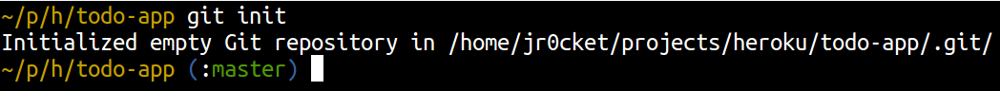
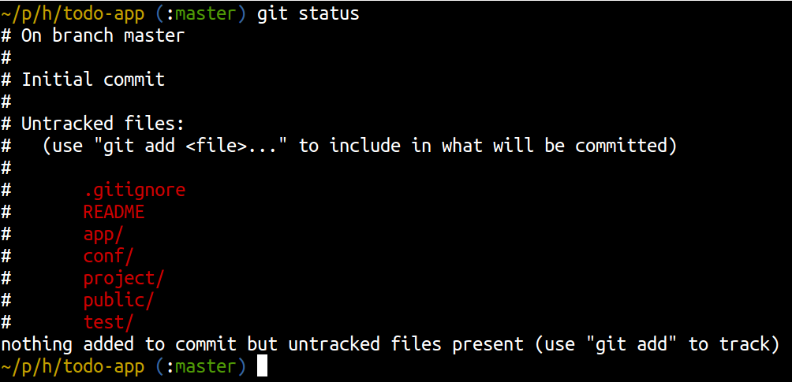
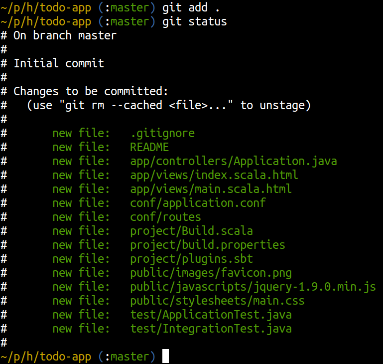
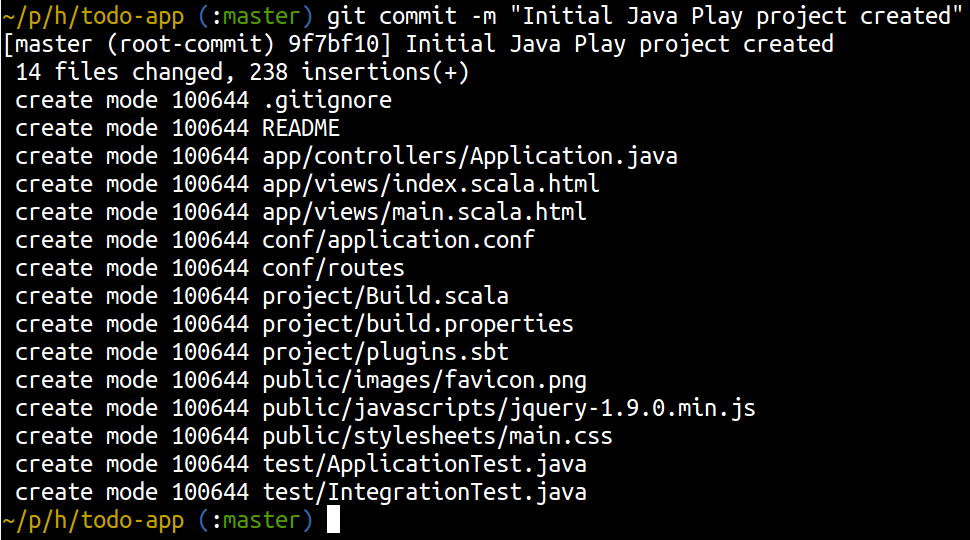

# <a id="top">Chapter 2: Manage project changes with Git</a>

  When developing software it saves so much time and hassel when you version your code.  Using distributed version control systems like Git allow you to collaborate effectively too.  You can share specific changes you are making across branches and different repositories.  
  
  When using a service like Github you can also collaborate and run code reviews via pull requests.

## Version the project with Git

  A git client was added when you installed the Heroku Toolbelt, but you can also use any you have already installed.  
  
  Now you have created your play project, you will use Git to put your project under version control.  This will create a local git repository which is contained within a folder called *.git*.  It is therefore important that you never delete the .git folder as you will loose your version control history.

  Create (initialise) a new git repository inside your project folder

    cd my-project-folder
    git init

  You should now have an empty local git repository in which to manage your changes.  

  Check this worked by viewing the current status of your git repository

    git status

 You should see a list of files that are not currently tracked by git.

Add the project files to your git repository & commit the changes:

    git add .
    git commit -m "Initial Java Play project created"

Any changes you now make to these project files can be tracked using `git status`.

## Some files dont belong in your projects

  You can tell git to not include certain files, folders and name patterns, so when you do a `git add .` then these files wont be added by mistake.
  
  This is done by creating a `.gitignore` file in your project.  When using Play to create your projects then an appropriate .gitignore file is created for you, with the default file and folder exclusions for your Play project.
  
  If you are using an editor or IDE that creates its own files and folders that you dont want to include in your project, you should create a global git ignore file in your home directory.
  
    ~/.gitignore_global

  The files and folders you add in the global gitignore file will be excluded from all your projects managed with Git.  The .gitignore file will only exclude files and folders from its specific project.
  
  See the [global folder of the Github gitignore repository](https://github.com/github/gitignore/tree/master/Global) for suitable global gitignore files for your development tools (eg. [Eclipse](https://github.com/github/gitignore/blob/master/Global/Eclipse.gitignore), [Emacs](https://github.com/github/gitignore/blob/master/Global/Emacs.gitignore), [InteliJ](https://github.com/github/gitignore/blob/master/Global/IntelliJ.gitignore), [Netbeans](https://github.com/github/gitignore/blob/master/Global/NetBeans.gitignore)).

[Next](03-deploy-your-application-on-heroku.html)
[Back to top...](#top)
[Back to Workshop Home](/index.html)

