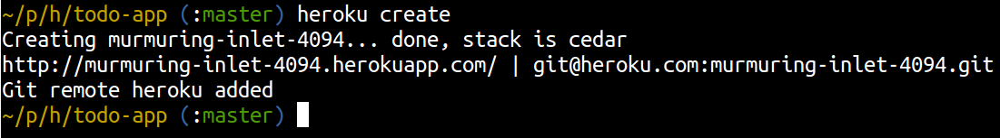

<link href="index.css" rel="stylesheet" type="text/css">

# <a id="top">Chapter 3: Deploy your application on Heroku </a>

  You have a working Java Play appliction running locally, it does not do very much but it works.  Lets deploy it to heroku so we have a live application on the Internet.  This gives us a website to test our application out and a convienient website for people to visit to see our work as it evolves.

   Although your application is publicly available once its deployed on Heroku, unless someone has the unique web address they wont be able to find it.  Heroku does not provide a public list of the applicaitons deploy upon it, so the world wont see it until you tell it your website address.

## Creating your Heroku application

  Create a new heroku application in the root of the project folder

    heroku create

  You should get an output similar to the following (although you will have a unqiue name for your heroku app):

    $ heroku create
    Creating damp-sands-1586... done, stack is cedar
    http://damp-sands-1586.herokuapp.com/ | git@heroku.com:damp-sands-1586.git
    Git remote heroku added

  You will notice that a new remote repository called heroku has been added to your git settings, this is the address of the git repository at Heroku you will upload to in order to deploy your code.

  To check the heroku remote was added and to see the address of the remote git repository,  you can use the standard git command:

    git remote -v

  When you created your Heroku application, you could have chosen to specify a specific name for your application.  The name used forms part of the website address (name.herokuapp.com), so that name must be unique across all Heroku applications.

    heroku create my-unique-app-name

  You can change the name of your application on Heroku later.  If you do, you will also have to update the address of the Heroku remote repository using 'git remote set-url heroku the-new-address'

## Pushing your project to Heroku

  Once you have an Heroku application, you can push any committed project source code to the Heroku git repository which was added when you created the application.  To check that you actually put your code into git, you can use the git log to check what was last commited.

    git log

</a>

  Your have code in your local git repository for your project, so you can push that up to Heroku using the standard git push command

    git push heroku master

  Everything you committed to your local repository will now be pushed up to the remote Heroku git repository securely (using a secure shell connection).  Git also compresses the commits before sending them to Heroku, so that the minimum bandwidth is used. Once the Heroku repository is updated with the push, this will trigger the building, deploying and running of your application automatically.

  The first time you deploy your project, your build file will be used to download all the project dependencies (external libraries), so it may take a few moments to complete.  If you look back at the output generated, you will see all the libraries that have been downloaded and notice that many of them come from an Heroku mirror location.  As Heroku uses a mirror for the most popular libraries, the deployment time is reduced.

## Heroku recognises Play framework

  Heroku will automatically recognise you have uploaded a Java Play framework and will know how to run it.  It is just one of the polyglot languages and frameworks that Heroku knows about.

  If you want to make any changes to the default way play runs, eg. by adding different data sources then you may need to specify a Procfile to define how the application should run.  Writing a Procfile will be covered soon.

  The overal process is managed by a build pack and you can customise existing build packs (open source) or create your own from scratch.  For more information on build packs, see the Heroku documentation.

## Check your application is running on Heroku

  At any time you can open your application by loging into the heroku website and viewing your apps.  You can also open the specific application you are working on via the command line.  In your project folder, use the command:

    heroku open

  When you pushed changes to Heroku git repository and it triggering a successful deployment, you would have been shown the address (URL) of your application at the end.  You could also copy/paste that address into your browser.

  You can now visit the website of your live application and give that address to others.

[Next: Developer workflow for Git and Heroku](04-developer-workflow-for-git-and-heroku.html)
[Back to top...](#top)
[Back to Workshop home](/index.html)
