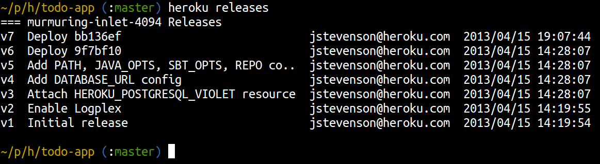

<link href="index.css" rel="stylesheet" type="text/css">

# Releases & Rollbacks

  As its so quick and easy to deploy to heroku it is a great platform for agile development and continuous deployment.  With a simple git push you can new features, change the way the application looks as well as add more features.
  
  As typically there are many releases of a application, Heroku gives you a very easy way to see what releases have been made.  As software development is still a human activity then errors are inevitable, so Heroku provides an effective way carry out rollbacks to keep your site live.

## Working with releases

  To see your current list of releases for your application, use the following command within your project folder:

    heroku releases

  You should already have several release for your application, even if you have only done one or two pushes.  When you created your application uisng `heroku create` then several releases took place automatically.

  Your release history should look similar to the following:
  

  
  Notice that each relase is related to a commit number used in Git.  This commit number gives you traceabitliy between your version control system and your deployed appliations.
  
  You can also dig deeper and see more details about latest release or any specific release using the following commands: 

    heroku releases:info
    heroku releases:info v24

## What triggers a new release

  It is important to understand what triggers a new release on Heroku.  As well as using git push to upload new commits, the following actions also create a new release.
  
* Updating environment variables
* Adding an Heroku add-on

## Rolling back a release 

  Should you deploy a new release and then realalise there is a problem, it is very quick to rollback to the previous release of your application.
  
  You can rollback to the previous release:
  
    heroku rollback
    
  Or you can specify a release number to roll back tool
  
    heroku releases
    heroku rollback v24

  When you rollback, all the new requests coming into your app are immediately routed to the rollbacked release.  It is quicker to rollback than to to push a fix.
  
  Rollback is actually a roll forward, but with a previous release.  
  
  Assuming you pushed a new change to heroku and that created v25.  If you do a rollback at that point then you actually create a new release v26 from v24.  v24 is just coppied and made v26.
  
  This gives you time to go and fix the root cause of the problem.  When you have fixed the problem and pushed the code to create a new release, you will be running on v27.
  
> A rolback should be considered a temporary fix to the problem.  You should resolve the underlying cause quickly and push that change to Heroku.  If a new release is triggered before you commit a proper fix then the original problem may occur again as you are deploying from an unchanged code base.

[Back to top...](#top)
[Next...](11-working-with-heroku-logs.html)
[Back to Workshop home](index.html)

