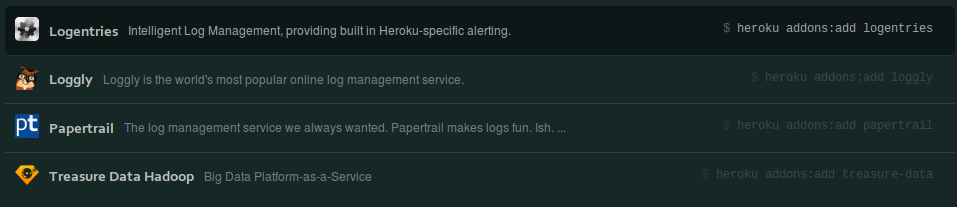

# Logiplex - unified loggin

  Heroku pulls all the logs from the system and your application into a single source called the Logiplex.  This makes it very easy to see related issues and more clearly understand the status of your application.

  Look at the logs from your application with:
  
    heroku logs 

     -n, --num NUM        # the number of lines to display
     -p, --ps PS          # only display logs from the given process
     -s, --source SOURCE  # only display logs from the given source
     -t, --tail           # continually stream logs

Example:

     $ heroku logs
     2012-01-01T12:00:00+00:00 heroku[api]: Config add EXAMPLE by email@example.com
     2012-01-01T12:00:01+00:00 heroku[api]: Release v1 created by email@example.com

## Debugging with continuous logging output

  You can use the `--tail` option to continually show new log messages as they arrise.  This is really useful if you need to debug a problem.
  
  Assume that there is a problem with your app and in a seperate terminal window, urn the following command from your project folder
  
    heroku logs --tail --source app --num 30

  If you now introduce a bug into your code when you deploy a new version, then the error message should show up as soon as the new version is running.
  
  Running the logs with the tail option is a simple way check if there are any errors during a deployment and may allow you to catch a problem early so your customers are not affected.
  

## Displaying just your app logs

  Although the logs are unified, you can still see the specific logs generated by your application by specifying the following option to heroku logs:

    heroku logs --source app

  Similarly, you can just view the System logs, these are messages about actions taken by the Heroku platform infrastructure on behalf of your app, such as: restarting a crashed process, idling or unidling a web dyno, or serving an error page due to a problem in your app. (Filter: 
  
    heroku logs --source heroku

  You can also view just the the API logs from within the system logs.  The API logs are messages about administrative actions taken by you and other developers working on your app, such as: deploying new code, scaling the process formation, or toggling maintenance mode. 
  
    heroku logs --source heroku --ps api

## Keeping your logs around

  Heroku only keeps logs for a short time as logs take up a lot of space and most of the time you wont need to look at them.
  
  If you need to keep you logs around for more time, there are several add-ons that will persist your logs.  This can be a requirement if your company works in a very regulated industry.
  

  
  If you are also experiencing performance problems, having the logs around can help highlight issues with your application.  Intermittent problems are particularly hard to find, so this may require looking for patterns over a longer period of time.
  
  Running anaysis and reporting tools over your logs can also give you insight into your customer activitiy and relavite performance of your application.  This information can be used to help you scale your application appropriatly.  Remember that you can scale down your app just as easily as scalling up and the benefit of a cloud platform is that you do no need to pay for resources you dont want.

## Additional resources

* [Heroku logging](https://devcenter.heroku.com/articles/logging)
* [Getting started with Logly](https://devcenter.heroku.com/articles/loggly)
 
[Back to top...](#top)
[Next...](12-searching-logs-with-papertrail.html) 
[Back to Workshop home](index.html)

